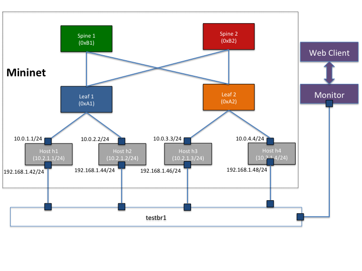
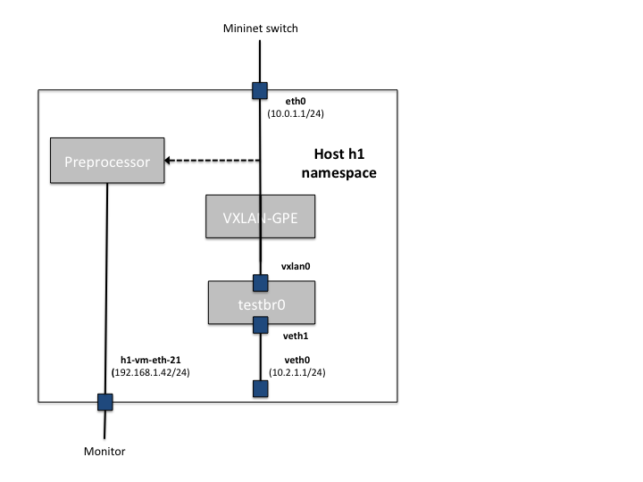

Overview
========
First:  you are well advised to read the entire file before starting.  ;-)

This is a reference implementation of the Inband Network Telemetry (from now called just "INT") [specification](http://p4.org/wp-content/uploads/fixed/INT/INT-current-spec.pdf), which allows programmable switches to embed telemetry information directly into data packets.  The application has three components - a preprocessor, a monitor and a user interface (details below).  This app collects the packet latency at each device in the simulated topology and plots the output in the user interface visualizer. 

This example uses the "INT over VxLAN-GPE" header format.

Setting up the environment
===========================

* Ensure that the following dependencies are met before running the INT reference application
  * Install linux kernel 3.19 (command for Ubuntu:)

            sudo apt-get install linux-generic-lts-vivid

  * Install docker (important: do NOT do "apt-get install docker" or "apt-get install docker.io" ... if docker.io is already installed you may need to apt-get remove it...)

            curl -sSL https://get.docker.com/ | sh

  * Install other dependencies

            sudo apt-get install python3 
            sudo apt-get install python3-pip 
            sudo apt-get install bridge-utils
            sudo pip3 install scapy-python3
            sudo pip3 install websockets 

* Build a docker image for the switch

        cd p4factory
        sudo ./install_deps.sh
        cd p4factory/targets/switch
        make docker-image
        make switchapi_THRIFT

* Build and install the VXLAN-GPE driver provided in the repo

        cd p4factory/apps/int/vxlan-gpe
        make
        sudo ./install_driver.sh
        
* You can verify that the driver has been installed successfully using the following checks -

        lsmod | grep vxlan     # - this should list vxlan as one of the loaded modules
        dmesg | grep "VXLAN-GPE"  # - this will show "Loading VXLAN-GPE driver"

Running the reference application
=================================
The reference applet consists of a multi-device mininet emulated network, described in the topology python file.  This script starts the mininet environment and configures the devices and links between them. It also starts a full mesh of pings between the hosts as background traffic.  To start mininet and run the reference topology:

        cd p4factory/mininet
        sudo ./int_ref_topology.py

To visualize the telemetry data generated by the mininet topology, open a web client on the same machine and load the visualizer HTML page.  Don't forget to prepend the directories appropriate to your local install for the full URL.  

    p4factory/apps/int/monitor/client/index.html
    
* **NOTE:** The web client has been fully tested only on Google Chrome.

Restarting the reference application
====================================
To restart the application, perform the following steps:
* Close the web client (close the browser or the tab containing the index.html URL)
* Stop the mininet script 'int_ref_topology.py' by entering "quit" at the mininet> prompt
* Run the cleanup script as follows -
    
        cd p4factory/mininet
        sudo ./int_cleanup.sh
        
Now restart the application as described in the previous section (sudo int_ref_topology.py and reopen the index.html URL)

Architecture of the reference application
=========================================
**Test network:** A test network of INT capable switches and hosts is created
using mininet.

The application is composed of 3 major components:

1. **Preprocessor:** The preprocessor process runs on each host, and strips out the INT headers and metadata values from each packet and sends them to a central monitoring process.
2. **Monitor:** The monitor process -
    * Receives INT data from all the mininet hosts.
    * Aggregates the data and performs new flow and path change detection.
    * Sends the processed monitor data to to a web client
3. **Web client:** the web client receives information from the monitor process and performs the visualization within a browser instance.

Test network topology
==========================
We use mininet to set up a test network for the application. The network is composed of 4 hosts, 2 leaf switches, and 2 spine switches. The following diagram illustrates the topology in greater detail.

Each emulated mininet host is configured with 3 network interfaces:

1. eth0 : Connected to one of the ToR switches
2. veth0 : A VTEP that connects to a VXLAN (on the 10.2.1.0/24 subnet)
3. hN-vm-ethM: Connects to the monitor process 
   (N and M are unique numbers used per host)

Routing configuration of the switches
-------------------------------------
* All switches run eBGP (via Quagga) to exchange routing and topology information.
* Each leaf switch has its own unique AS number, and the spine switches share one common AS number.

Background traffic
------------------
The mininet script automatically invokes full-mesh ping sessions among all the four end hosts.

End-host networking stack
=========================

VxLAN-GPE Driver
----------------
The linux VXLAN driver has been modified to use UDP port 4790 and use the VxLAN-GPE 
header format.  It inserts/removes the INT shim header and INT metadata headers at 
INT source and INT sink respectively.  (Details of this operation are in [the spec](http://p4.org/wp-content/uploads/fixed/INT/INT-current-spec.pdf).

INT Sources
----------
As described in an earlier section, each mininet host has a VTEP endpoint.  The VXLAN-GPE driver enables the INT source functionality on all IP unicast packets sent through its VTEP.  Within the INT metadata header bits are set for {switchID, hop latency, queue occupancy}. These bits instruct each switch along the path to add the specified telemetry information to the metadata stack of the packet.

INT Sink
----------
Each mininet host runs an instance of the preprocessor process, which captures all the VXLAN-GPE packets received. The preprocessor strips out the INT headers and metadata values from each packet and sends them to the monitor process.

Web client UI
=============

The web client connects to the monitor process via a websocket (a protocol that provides full-duplex communication channels over a single TCP connection).  The monitor notifies the client when either a new flow is detected in the network or a path change is detected in an existing flow. Additionally, the monitor periodically (10ms) sends the max queueing latency within that time window to the client.

The UI has the following components: 

1. **Flow filter:** A drop down box that lists all flows seen in the network.
   Choose one of the options to view data corresponding to a particular flow
2. **Network topology graph:** Visualizes the topology of the mininet network.
   For a given flow, the topology graph highlights the flow's current path in
   blue. In case of a path change in the flow, the old path is highlighted in
   red.
3. **Real-time hop latencies per switch:** One time series graph is shown per
   switch: each bar in the graph indicates the high-water latency value at that
   switch in each 10ms time window. These time series charts refresh every
   1 sec.
4. **Notifications window:** Whenever a loop is detected, a text notification is
   displayed here.  

The switches are color-coded in the graphs with a legend immediately below the topology diagram.

Test cases (or, "start hacking")
========================================
As a starting point, here are two simple test cases that can be built on top of the baseline topology and tools:

Example 1: iperf test
----------
As a reminder, the mininet script launches iperf servers (listeners) on all four hosts, and starts two iperf clients (talkers) on hosts h1 and h3.  Additional iperf clients can be started manually as follows:

        mininet> h1 xterm
        iperf -c 10.2.1.3 -t 60     # run this inside the launched xterm to start a new iperf session

Once started, the monitor and web client will be notified of the new connection, and you can select it via the flow filter on the UI. The web client will confirm the physical path the connection is taking, as well as the latency values collected via each packet along the network path.

Example 2: routing fail-over test
--------------
  * Start a long-running iperf connection between h1 and h3.  Check which spine switch the connection passes through, using the web client UI.
  * Open a terminal on the leaf1 switch using the command "leaf1 xterm" at the mininet CLI.
  * If the connection is going through spine1, shut down the port on leaf2 that
    is connected to spine1. You can do this by typing "ifconfig swp3 down" in 
    the leaf1 xterm. If it is going through spine2, type "ifconfig swp4 down"
    instead.
  * Confirm the physical path for the ongoing connection changes after 3sec,
    which is the BGP hold-down timeout.

Known issues, performance limitations
---------------
* If you run the entire topology on a machine with limited CPU resources and run multiple high-volume connections, the setup can get overloaded.  In such a situation, the reported hop latency values may be very high due to scheduling variability  in the packet-handling threads.  This can be mitigated (but only to a small extent) by prioritizing the switch processes.
* Changes such as adding switches, increasing the bandwidth of the mininet links, or adding active connections can increase the contention for CPU cycles.  Check the CPU utilization of the system if inconsistent results are observed.
* the iperf server process may hang under high workload (under investigation)
* Do not reload/refresh the web client page while application is running - if this occurs the connection between the client and monitor process will drop and **both** will need to be reset (See "Restarting the reference application" above).
* 
